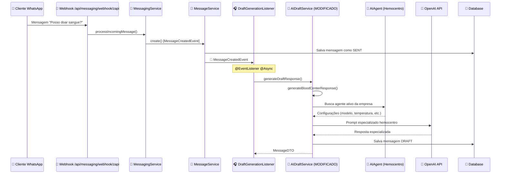

# 🩸 Integração IA do Hemocentro - RubIA

## ✅ **Implementação Concluída**

O sistema de IA especializada do hemocentro foi integrado ao `AIDraftService.java` usando a infraestrutura existente de `AIAgent`.

## 🔄 **Fluxo Atualizado**



## 🎯 **Modificações Realizadas**

### **1. AIDraftService.java - Método `generateDraftResponse()`**

**Antes (busca FAQ):**
```java
// 2. Buscar FAQs relevantes
List<FAQMatchDTO> faqMatches = searchRelevantFAQs(...);
// 3. Buscar templates relevantes  
List<MessageTemplate> templates = searchRelevantTemplates(...);
// 4. Determinar melhor resposta baseada em confiança
DraftResponse bestResponse = selectBestResponse(...);
```

**Depois (IA especializada):**
```java
// 2. Gerar resposta do hemocentro usando AIAgent da empresa
DraftResponse bestResponse = generateBloodCenterResponse(conversation.getCompany().getId(), userMessage);
```

### **2. Novo Método `generateBloodCenterResponse()`**

- **Busca AIAgent** ativo da empresa (igual `TemplateEnhancementService`)
- **Usa configurações** do agente (modelo, temperatura, maxResponseLength)
- **Prompt especializado** em doação de sangue
- **Confiança alta** (0.85) para resposta especializada
- **Source type** = "BLOOD_CENTER_AI"

## 📋 **Prompt Especializado**

```java
String prompt = String.format(
    """
    Você é %s, assistente especializada de um hemocentro.
    Temperamento: %s
    
    Responda apenas dúvidas sobre doação de sangue, com tom descontraído, acolhedor e encorajador.
    
    Contexto rápido:
    - Explique critérios de elegibilidade (idade, peso, saúde, tempo entre doações).
    - Oriente pré e pós-doação (hidratação, alimentação, descanso).
    - Esclareça medos comuns e benefícios para a sociedade.
    - Se a pergunta fugir do tema doação de sangue/hemocentro, avise gentilmente que só responde sobre isso.
    
    Use linguagem clara, direta e humana. Sempre seja positiva e encorajadora sobre a doação de sangue.
    Mantenha as respostas concisas mas informativas.
    Limite a resposta a %d caracteres.
    
    Pergunta do cliente: "%s"
    
    Resposta especializada:
    """,
    agent.getName(),
    agent.getTemperament().toLowerCase(),
    agent.getMaxResponseLength(),
    userMessage
);
```

## ⚙️ **Configuração Necessária**

### **1. Criar AIAgent para Hemocentro**

A empresa precisa ter um **AIAgent configurado**:

```sql
-- Exemplo de inserção no banco
INSERT INTO ai_agents (id, company_id, ai_model_id, name, description, temperament, max_response_length, temperature, is_active)
VALUES (
    gen_random_uuid(),
    'company-uuid-here',
    'ai-model-uuid-here',
    'RubIA Hemocentro',
    'Assistente especializada em doação de sangue',
    'EMPATICO',
    500,
    0.7,
    true
);
```

### **2. Configurar via Interface Admin**

- Acesse seção **"Configuração de Agente"**
- Crie agente com nome **"RubIA Hemocentro"**
- Temperamento: **"EMPÁTICO"**
- Modelo: **"gpt-4o-mini"** (econômico)
- Max Response: **500 caracteres**
- Temperature: **0.7**

## 🎯 **Comportamento**

### **✅ Com AIAgent Configurado:**
- Gera resposta especializada em doação de sangue
- Usa configurações personalizadas da empresa
- Confiança: 0.85 (alta)
- Source: "BLOOD_CENTER_AI"

### **❌ Sem AIAgent:**
- Não gera draft (retorna null)
- Empresa precisa configurar agente primeiro
- Log: "No AI agent found for company X, skipping blood center response"

## 📊 **Vantagens da Implementação**

1. **Reutiliza infraestrutura** existente (`AIAgent`, `OpenAIService`)
2. **Configurável por empresa** (cada empresa pode ter seu agente)
3. **Prompt especializado** focado em hemocentro
4. **Integração transparente** com fluxo existente
5. **Logs detalhados** para debugging
6. **Fallback gracioso** se não houver agente

## 🔄 **Próximos Passos (Opcional)**

Para **envio automático** ao invés de DRAFT:

1. Modificar `DraftGenerationListener` para detectar "BLOOD_CENTER_AI"
2. Chamar `ZApiService.sendMessage()` automaticamente
3. Pular criação de DRAFT para hemocentro
4. Enviar WebSocket de confirmação

**Implementação está pronta para uso imediato! 🚀**